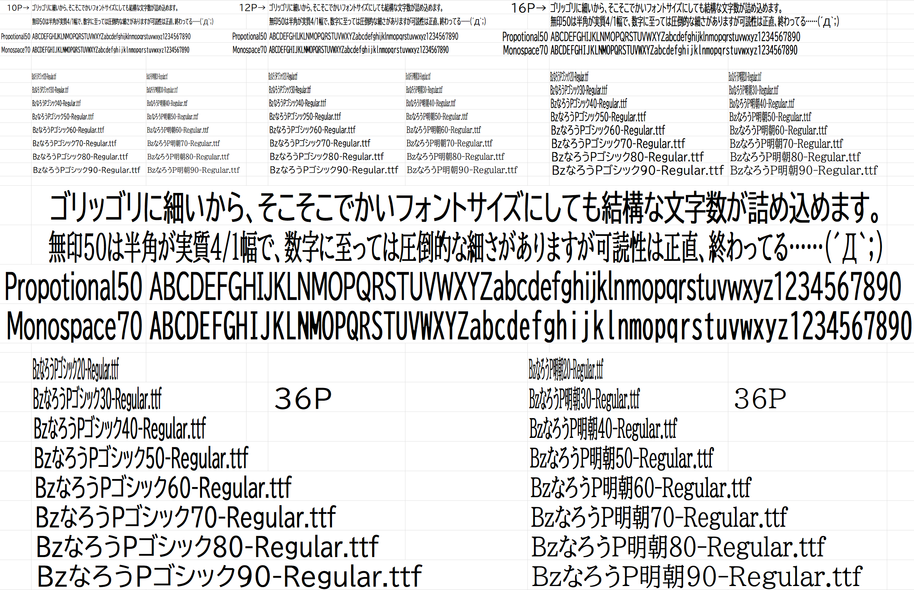

# Bzなろうゴシック / Bzなろう明朝

ユニバーサルデザインフォントの
[BIZ UDゴシック](https://github.com/googlefonts/morisawa-biz-ud-gothic)
[BIZ UD明朝](https://github.com/googlefonts/morisawa-biz-ud-mincho)
を長体化しただけのフォントです。

## 概要

縮めただけです。Excelとか自分で長体化ができないソフトで使うつもりで作りました。

## ライセンス
改変元のフォントと同じく、SIL OPEN FONT LICENSE Version 1.1となっています。

### 既知の問題
特に明朝体、TTCにパックしようとしたらコケる。何が悪いんだろう？
加工時に参照が不正ってエラーがたくさん出る。
処理がすんんんんんごい重たい。

### 余談1

そもそも和文コンデンスドフォント（和文ナローフォント、和文長体フォント）は、
プロ向けのフォントしか見当たらないから会社で使えなくて困るんよ。

先にも書いたとおり、Excelでコンデンスドフォントを使うと
和英入り交じりの書式設定がクッソめんどくさいので
「これいっこ指定すれば文字詰め放題！」
って状態にしたくて作りました。

### 余談2

この成果物自体よりも、FontForgeのストロークで発生する
自己交差の問題を解決するプロセスの方が価値あるかもねー。

    ys_repair_Self_Insec
    glyph.round()
    glyph.removeOverlap()

って具合に、ツノ折って整数化で固めて結合で捨ててます。

【Font Forge】自己交差を解消する方法 | Misskey.io
https://misskey.io/@yamatsumi_s/pages/1732899206177

### 余談3

幅広げたいだけなら隣に並べて結合していけば良いんじゃネ？
と思って試してみたけど、あまりにも重たくなりすぎて……
とてもスクリプトが完走しそうに無いのが難……

失敗した取り組みに関してはさておき、
現状のモノでもスクリプト書き換えればいろんなフォントで同じ事ができるけど、
この処理むっっちゃくちゃ重たいですし、おすすめは出来ませんなー。

Ryzen5700Gで8並列でブン回して5時間ぐらい？
使用メモリは1プロセスあたり600MBくらいだから、
メモリは5GBほど開けとかないと落ちると思う。
コアとメモリの空きに合わせてPS1スクリプトの並列度は変えるよろし。

### 余談4

以前は「はんぶんゴシック」などの名前でファミリ名を変えていましたが、
名前のバリエーションがめんどくさくなったので改名しちゃった……('A`)
無機質だけど、この方がわかりやすいし良いかなって……

ほんで、なんで今の名前が「narrow」じゃなくて「narow」にされてるかっていえば、
今後、真っ当にナローフォントを作る人の邪魔になる気がしたんで敢えてのtypoです。

